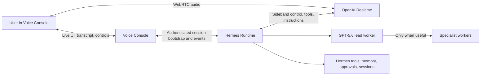

# GPT-Realtime-2.1 Hermes Runtime Design

**Date:** 2026-07-15

**Status:** Approved

**Product boundary:** Hermes Voice Console plus an upstream-first Hermes runtime capability

## Summary

Hermes Voice Console will become a live, full-duplex conversational interface to an existing Hermes agent. GPT-Realtime-2.1 is the primary persona and dispatcher for Voice Console sessions. Hermes remains the agent harness/runtime around the model: it assembles identity and context, exposes tools, enforces permissions and approvals, owns memory and sessions, and coordinates durable delegated work.

The product is not another voice-message transcription loop. The default experience is an ongoing call with Hermes: natural turn detection, interruption, immediate conversation, visible tool activity, and delegated work that continues while the user keeps talking.

Realtime Hermes handles normal conversation and fast, low-risk, single-step actions. It automatically delegates code, deep reasoning, multi-step work, meaningful state changes, and substantial deliverables to one GPT-5.6 lead worker by default. That worker may fan out only when the task has genuinely separable parts or benefits from independent verification. Workers never become conversational personas; Hermes remains the sole voice and interprets their progress and results.

This direction requires a versioned Realtime session capability in Hermes. It is not satisfied by adding `gpt-realtime-2.1` to a model picker. The integration will be upstream-first. A temporary proof patch is acceptable for validating the seam, but a permanent Hermes fork is not.

## Product promise

The user can stay in a natural live conversation with Hermes while Hermes supervises capable background workers. The experience should feel like one persistent agent who can act, delegate, report, recover, and remain present—not a voice frontend that switches among bots or sends asynchronous voice messages.

Success is reached when the user verifies that this relationship feels materially different from Telegram voice messages.

## Locked product decisions

- GPT-Realtime-2.1 is the primary persona and dispatcher for Voice Console sessions.
- Hermes is the harness/runtime, not the language model.
- Hermes remains naturally conversational; there is no five-line limit on his responses.
- The five-line heuristic applies to the expected task or deliverable size.
- Code, deep reasoning, multi-step work, substantial artifacts, and meaningful state changes delegate automatically.
- Fast, low-risk, single-step tools and worker-control actions may stay with Realtime Hermes.
- Delegation requires no confirmation. Hermes announces the handoff and starts it.
- Existing Hermes approval rules still govern sensitive actions.
- One GPT-5.6 lead worker starts by default.
- Additional workers appear only for separable work or independent verification.
- The live conversation stays open while workers run.
- The user can refine, redirect, inspect, or cancel delegated work without waiting.
- Hermes is the sole conversational persona. Workers return progress and results through him.
- Worker identity, tools, progress, approvals, and artifacts remain visible in the main conversation experience.
- The primary voice mode is full-duplex with natural turn detection and barge-in.
- Tap-to-mute and manual turn-taking remain available fallbacks.
- Realtime support is upstream-first. A proof patch may be temporary; a long-lived Hermes fork is prohibited.

## Compatibility research

Research on 2026-07-15 found that GPT-Realtime-2.1 is not currently usable in Hermes by selecting it as a normal model.

OpenAI documents GPT-Realtime-2.1 as supporting only the stateful Realtime endpoint, with speech-to-speech interaction and function calling. Hermes's public provider runtime currently resolves request/response inference modes such as Chat Completions, Codex Responses, Anthropic Messages, and Bedrock Converse. Its model-provider plugin contract does not expose a Realtime session transport.

A dynamically discovered catalog could potentially display the model name, but selection alone would not create the required session lifecycle. Hermes would still route the model through an incompatible API shape.

Hermes already has the important reusable product substrate:

- Agent profile identity and SOUL.
- Memory, skills, workspace, and session state.
- Tool registry and dispatch.
- Permissions and approvals.
- Durable runs and event streaming.
- Subagent delegation with configurable provider and model.
- A machine-readable API capability endpoint.

The missing piece is a generic Realtime session doorway into that substrate. Existing agent profiles should not require a data or identity migration.

### Research sources

- [GPT-Realtime-2.1 model contract](https://developers.openai.com/api/docs/models/gpt-realtime-2.1)
- [OpenAI Realtime server-side controls](https://developers.openai.com/api/docs/guides/realtime-server-controls)
- [Hermes provider runtime](https://github.com/NousResearch/hermes-agent/blob/main/website/docs/developer-guide/provider-runtime.md)
- [Hermes model-provider plugin contract](https://github.com/NousResearch/hermes-agent/blob/main/website/docs/developer-guide/model-provider-plugin.md)
- [Hermes configuration and delegation](https://github.com/NousResearch/hermes-agent/blob/main/website/docs/user-guide/configuration.md)
- [Hermes API Server capability surface](https://github.com/NousResearch/hermes-agent/blob/main/website/docs/user-guide/features/api-server.md)

## Approaches considered

### 1. Hermes-controlled WebRTC session — selected

The browser carries low-latency audio directly to OpenAI over WebRTC. Hermes creates and controls the session through a server-side sideband connection, supplies the persona and tools, handles function calls, enforces approvals, and owns delegation and durability.

This keeps GPT-Realtime-2.1 genuinely inside the Hermes product boundary without placing audio proxy complexity or secrets in the browser.

### 2. Voice Console-owned Realtime facade — rejected

Voice Console could own the live model and call Hermes only for delegated jobs. This would be simpler initially, but it would create two agent authorities: a conversational imitation of Hermes in the console and the real Hermes runtime behind it. Persona, memory, tools, permissions, and sessions could drift.

### 3. Backend-proxied Realtime audio — rejected

Voice Console could proxy all audio through a server-side WebSocket. This would centralize control but add avoidable latency, bandwidth, buffer management, and interruption complexity while giving up the browser/WebRTC path recommended for live client audio.

## System architecture

### Browser and Voice Console

The browser maintains the WebRTC media connection for low-latency audio. Voice Console remains the authenticated control surface for:

- Conversation and transcript display.
- Connection and compatibility state.
- Worker activity and artifacts.
- Inline tool activity.
- Approvals.
- Interruption, mute, and manual-turn controls.
- Recovery and explicit legacy-mode fallback.

The browser never receives long-lived OpenAI credentials, Hermes target credentials, or private tool implementations.

### Hermes Realtime capability

A new versioned Hermes capability:

- Creates or authorizes the Realtime session.
- Assembles the existing agent's persona and relevant context.
- Attaches the server-side sideband controller.
- Publishes the allowed direct tools and delegation controls.
- Translates Realtime function calls into Hermes tool dispatch.
- Applies permissions and approvals.
- Tracks live-session state against durable Hermes tasks and sessions.
- Returns worker progress and results to Realtime Hermes.

The capability must be generic enough to support validated future Realtime models without another architectural rewrite.

### Worker runtime

Each substantial request creates one durable GPT-5.6 lead-worker job. That job survives browser closure, Realtime reconnection, and live-session rotation. The worker may spawn specialists only when the work is separable or requires independent verification.

Workers return structured completion information:

- Work completed.
- Artifacts or changes produced.
- Verification performed.
- Risks, uncertainty, and remaining decisions.

Hermes evaluates and communicates the result in his own voice.

## Live conversation and dispatch flow

1. The user opens Voice Console and passes authentication and compatibility preflight.
2. Hermes creates a Realtime session and provides short-lived browser bootstrap material.
3. The browser establishes WebRTC audio with GPT-Realtime-2.1.
4. Hermes attaches the server-side control connection and supplies persona, context, and tool definitions.
5. The user and Hermes converse with natural turn detection and interruption.
6. Hermes classifies each request as conversation, direct action, or delegated work.
7. Direct actions execute through the restricted Hermes tool surface.
8. Substantial work is announced and dispatched automatically to one lead worker.
9. The live conversation remains available while the worker runs.
10. User refinements, redirects, status requests, and cancellations are applied to the durable job.
11. Worker questions are answered from existing context where possible; Hermes asks the user only when a missing choice materially changes the result.
12. Hermes evaluates the worker's completion and presents it while the console exposes artifacts and evidence.

Realtime session rotation or reconnection must not cancel or duplicate durable work. Hermes reconstructs a compact conversational handoff and reattaches active worker state.

## Routing policy

### Realtime Hermes handles directly

- Natural conversation and normal-length responses.
- Short explanations and immediate questions.
- Fast, low-risk, single-step lookups.
- Memory lookup and known-item retrieval.
- Active-worker status, refinement, redirection, and cancellation.

### Hermes delegates automatically

- Any code task.
- Deep reasoning or research.
- Multi-step tool use.
- Meaningful state changes.
- Plans, reports, drafts, or other artifacts expected to exceed roughly five lines.
- Work that benefits from durable execution or verification.

The heuristic is a routing policy, not a conversational output limit.

## Capability and upgrade contract

Realtime support must be explicit and behavioral. Voice Console must not infer support from a model name.

The Hermes API capability response must advertise a versioned contract covering:

- Realtime session creation.
- Server-controlled WebRTC bootstrap.
- Function-call dispatch through Hermes tools.
- Persona and context assembly.
- Approval enforcement.
- Durable delegation and worker events.
- Session-state association and recovery.
- Supported provider/model availability.

Voice Console performs this preflight before enabling live mode. Missing capabilities produce a precise compatibility message and block Realtime startup. The console must never silently send GPT-Realtime-2.1 through Chat Completions or present legacy STT/TTS as Realtime.

### Platform-scoped model configuration

- GPT-Realtime-2.1 is primary for Voice Console sessions.
- GPT-5.6 is the default delegated-worker model.
- Telegram, CLI, cron, and other Hermes platforms retain their existing model configuration unless changed explicitly.

This prevents a voice-only endpoint from breaking non-voice platforms while preserving one shared agent identity and runtime.

### Upgrade safety

- Voice Console declares a tested Hermes capability range.
- Production pins a known-compatible Hermes release.
- Contract tests run against supported releases and current upstream.
- Unsupported Hermes updates fail during preflight, before a live agent is disrupted.
- The temporary proof patch stays small, isolated, and continuously rebased.
- The generic seam is proposed upstream.
- The proof patch is removed once upstream support ships.
- Model IDs remain configuration; behavior is governed by the capability contract.

## Safety, failures, and recovery

Hermes remains the authority for permissions. Realtime cannot bypass tool restrictions, approvals, workspace boundaries, or permanent-action policy.

Approval-required actions receive a brief spoken explanation and a complete visible approval card. Silence, ambiguous speech, or interruption never counts as consent. Approval requires an explicit interface action or an intentionally supported unambiguous voice confirmation.

Failure handling remains layer-specific:

- **Browser audio or WebRTC:** Text remains available. The user may explicitly choose the labeled legacy turn-based voice mode.
- **Hermes sideband control:** Tool execution and delegation pause immediately. Realtime cannot continue unsupervised actions.
- **OpenAI Realtime session:** Hermes creates a replacement session, supplies a compact handoff, and reattaches durable worker state.
- **Worker failure:** Hermes explains the useful failure reason and can retry, revise, or replace the worker.
- **Worker stall:** The job becomes visibly stalled rather than showing indefinite activity.
- **Browser closure:** Durable workers continue; reopening restores current state and completed results.
- **Speech cancellation:** Stops playback only.
- **Task cancellation:** Explicitly cancels the worker or underlying action.
- **Reconnect and retry:** Stable task identities prevent duplicate workers and repeated state changes.

Operational logs remain content-safe by default. They may contain identifiers, timings, model/provider names, state transitions, and error categories. They exclude raw audio, transcripts, agent responses, credentials, and sensitive tool arguments.

## Validation and acceptance

### Feasibility spike

Before redesigning the console, a clean current Hermes checkout must prove that a contained generic seam can:

- Start a real GPT-Realtime-2.1 WebRTC session.
- Attach Hermes through the server-side control channel.
- Load an existing agent's persona and relevant context.
- Execute one low-risk Hermes tool through native Realtime function calling.
- Launch one durable delegated worker through Hermes.
- Return the worker result to Realtime Hermes.
- Preserve approval enforcement.
- Avoid copying Hermes's agent loop into Voice Console.

If this requires broad invasive changes rather than a contained transport/session seam, stop and reassess the architecture.

### Automated validation

- Conversation stays with Hermes.
- Code, deep reasoning, multi-step tasks, substantial artifacts, and meaningful state changes delegate.
- The five-line rule never limits conversational response length.
- Exactly one lead worker starts by default.
- Additional workers appear only for separable work or independent verification.
- Worker progress, tools, artifacts, approvals, cancellation, and failure are visible.
- Reconnects and retries do not duplicate workers or state-changing operations.
- Missing or incompatible Hermes capabilities fail during preflight.
- Existing non-voice Hermes platforms keep their configured models.
- Supported Hermes upgrades pass the versioned compatibility suite.

### Human product acceptance

1. Hold a natural full-duplex conversation and interrupt Hermes successfully.
2. Ask a simple question and receive an immediate answer.
3. Request a code task and hear Hermes announce automatic delegation.
4. Continue talking with Hermes while the worker runs.
5. Refine, redirect, and cancel delegated work.
6. Complete an approval-required task without accidental consent.
7. Close and reopen the console while work continues.
8. Receive the worker's verified result through Hermes and inspect its artifacts.
9. Confirm that the experience feels like one persistent Hermes persona.
10. Confirm that the experience is materially different from Telegram voice messages.

## Non-goals

- Reimplementing Hermes's agent loop inside Voice Console.
- Maintaining a permanent Hermes fork.
- Making GPT-Realtime-2.1 the automatic model for every Hermes platform.
- Letting workers speak directly to the user as separate personas.
- Spawning multiple workers for every delegated task.
- Treating a model-catalog entry as proof of Realtime compatibility.
- Silently disguising the legacy STT/TTS loop as Realtime.

## Implementation boundary

The first implementation plan must begin with the Hermes feasibility spike and compatibility contract. Console redesign and production rollout follow only after that gate passes. The current turn-based STT/TTS path remains intact as an explicitly labeled fallback until the Realtime path has passed real desktop and mobile acceptance.
