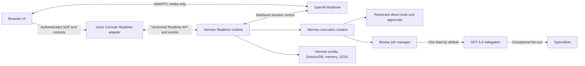

# GPT-Realtime-2.1 Hermes Runtime Implementation Plan

**Date:** 2026-07-15

**Status:** Ready for owner review

**Source of truth:** `docs/plans/2026-07-15-gpt-realtime-2-1-hermes-runtime-design.md`

**Product boundary:** A generic upstream Hermes Realtime capability plus its first product integration in Hermes Voice Console

**Execution posture:** Implement with normal engineering judgment and ordinary repository tools. No skill is required or assumed for any implementation phase.

## Outcome

Hermes Voice Console becomes a live, full-duplex conversation with the user's existing Hermes agent. GPT-Realtime-2.1 is the Voice Console persona and dispatcher; Hermes remains the harness/runtime that owns identity, context, tools, permissions, approvals, sessions, memory, and delegated work.

Realtime Hermes stays naturally conversational and handles low-risk, single-step actions. He automatically announces and delegates code, deep reasoning, multi-step work, meaningful state changes, and deliverables expected to exceed roughly five text-document lines. One GPT-5.6 lead worker starts by default. Additional workers are exceptional and require separable work or independent verification.

The implementation is complete only when the user can continue talking with Hermes while a worker runs, control that worker without leaving the conversation, recover across browser and Realtime reconnects, inspect real tool and artifact evidence, and confirm that the result feels materially different from Telegram voice messages.

## Non-negotiable product behavior

- GPT-Realtime-2.1 is primary only for Voice Console sessions. Telegram, CLI, cron, and other Hermes platforms keep their existing model configuration.
- Hermes is the only conversational persona. Workers never address the user directly.
- The five-line heuristic applies to the expected task or artifact, never to Hermes's response length.
- Delegation is automatic and requires no confirmation. Hermes announces the handoff and starts it.
- Existing Hermes approval rules still apply. Realtime cannot approve its own sensitive tool calls.
- V1 approval decisions are explicit authenticated UI actions. Hermes may explain an approval by voice, but ordinary speech and silence never resolve it.
- Exactly one GPT-5.6 lead worker starts by default.
- Fan-out is allowed only when the lead identifies genuinely separable work or a need for independent verification.
- Conversation remains usable while workers run.
- Status, refinement, redirection, cancellation, approvals, tools, artifacts, and verification remain visible in the main conversation experience.
- Full-duplex WebRTC with natural turn detection and barge-in is the primary voice mode.
- Tap-to-mute and manual turn-taking remain available.
- The current turn-based STT/TTS flow remains an explicitly labeled fallback until Realtime passes live desktop and mobile acceptance.
- The work is upstream-first. A temporary pinned proof patch is allowed; a permanent Hermes fork is not.

## Evidence and starting state

### Voice Console repository

The current product already has the important standalone-console substrate:

- Clerk and service authentication.
- Owner-scoped target and conversation sessions.
- A backend-owned Hermes Runs coordinator with reconnect fan-out and content-free SQLite metadata.
- Desktop and mobile shells over one shared controller.
- Inline conversation, tool activity, approvals, diagnostics, stop, and speech cancellation.
- A tested legacy voice path using browser PCM capture, server STT, Hermes Runs, and TTS playback.
- Fake target, backend protocol tests, frontend unit tests, and Playwright browser acceptance.

The two largest state machines must not absorb Realtime behavior:

- `backend/voice_console/voice_socket.py::handle_voice_socket` is already a large authenticated recording/run subscription state machine.
- `frontend/src/console/useConsoleController.ts::useConsoleController` already coordinates transport, recording, playback, recovery, sessions, approvals, messages, and both shells.

Realtime therefore enters through dedicated backend and frontend modules and is composed at narrow boundaries.

### Hermes upstream

Research was refreshed against Hermes `main` at commit `00a36831d214488f901df7de71efde02a8072aa4` on 2026-07-15. Re-pin the exact upstream SHA at implementation start because `main` moves quickly.

Current relevant facts:

- `hermes_cli/runtime_provider.py` supports request/response modes such as Chat Completions, Codex Responses, Anthropic Messages, Bedrock Converse, and Codex app-server. It does not expose a Realtime session transport.
- `gateway/platforms/api_server.py` advertises `realtime_voice: false` and has no Realtime session endpoints.
- `delegate_task(background=true)` now exists and is the correct low-level worker primitive for this product.
- `tools/async_delegation.py` persists dispatch metadata and terminal results in Hermes `state.db`, restores undelivered completions after restart, exposes recent status, and supports interruption.
- The running worker itself is process-bound. If Hermes exits before recording a terminal result, recovery classifies the outcome as `unknown`; execution does not resume automatically.
- Stateless API Server turns currently fall back from background delegation because detached completions have no routable parent session. A Realtime session must provide that route.
- Agent-loop tools such as delegation, memory, session search, approvals, and task state require more context than a raw tool-registry call. Realtime must reuse or extract that execution context rather than bypass it.

### OpenAI Realtime contract

The selected browser handshake is the unified WebRTC interface:

1. The browser creates a WebRTC offer and sends the SDP to the authenticated Voice Console backend.
2. Voice Console forwards the offer and owned conversation identity to Hermes.
3. Hermes combines the SDP with the platform-scoped Realtime session configuration and sends it to OpenAI's `/v1/realtime/calls` endpoint using a server-held standard API key.
4. Hermes captures the returned call identifier, attaches a server-side sideband WebSocket, installs persona, context, tools, and routing policy, and only then returns the SDP answer.
5. The browser applies the answer and carries media directly to OpenAI. The OpenAI key, Hermes key, tools, and private business logic never enter the browser.

Session activation is fenced as `provisioning -> controller_ready -> client_authorized -> active`. Hermes issues one controller lease for one session generation, heartbeats it, and rejects stale controller or client generations. If sideband setup, policy installation, or the initial acknowledgement fails, Hermes tears down the partial provider call and never returns usable bootstrap material. If the controller lease is later lost, Hermes marks the session degraded, stops accepting new tool/delegation calls, and directs Voice Console to close or replace the media session.

The feasibility spike must first prove an audio-only browser peer with all non-media control on the Hermes sideband. If OpenAI requires a browser data channel for any essential behavior, keep that channel minimal and untrusted: it may carry user input or presentation events, but it never becomes authoritative for instructions, tool outputs, approvals, worker state, or session configuration.

Research anchors:

- [GPT-Realtime-2.1 model contract](https://developers.openai.com/api/docs/models/gpt-realtime-2.1)
- [OpenAI Realtime WebRTC guide](https://developers.openai.com/api/docs/guides/realtime-webrtc)
- [OpenAI Realtime server-side controls](https://developers.openai.com/api/docs/guides/realtime-server-controls)
- [Hermes API Server source at the research SHA](https://github.com/NousResearch/hermes-agent/blob/00a36831d214488f901df7de71efde02a8072aa4/gateway/platforms/api_server.py)
- [Hermes runtime provider at the research SHA](https://github.com/NousResearch/hermes-agent/blob/00a36831d214488f901df7de71efde02a8072aa4/hermes_cli/runtime_provider.py)
- [Hermes async delegation at the research SHA](https://github.com/NousResearch/hermes-agent/blob/00a36831d214488f901df7de71efde02a8072aa4/tools/async_delegation.py)
- [Hermes delegation tool at the research SHA](https://github.com/NousResearch/hermes-agent/blob/00a36831d214488f901df7de71efde02a8072aa4/tools/delegate_tool.py)

## Architecture to implement



### Stable identity boundaries

Do not use one identifier for multiple lifecycles:

| Identity | Lifetime | Owner | Purpose |
|---|---|---|---|
| `conversation_id` | Durable until the user deletes the console conversation | Voice Console plus Hermes SessionDB mapping | Stable user-visible conversation and ownership boundary |
| `hermes_session_id` | Durable but may rotate when Hermes compresses or resumes | Hermes | Transcript, memory, and agent context |
| `realtime_session_id` | One provider WebRTC call | Hermes Realtime runtime | Ephemeral media and sideband lifecycle |
| `worker_job_id` | One logical delegated task | Hermes worker job manager | Stable status/control identity across Realtime rotation |
| `worker_attempt_id` | One execution attempt | Hermes async delegation | Retry, refinement, supersession, and outcome evidence |
| `client_request_id` | One mutating request | Calling client | Idempotency and ambiguous-acceptance protection |
| `provider_call_id` | One OpenAI call | Hermes only | Sideband attachment; never treated as a user-facing identity |
| `session_generation` | One fenced controller/client attachment | Hermes | Prevent stale peers, sidebands, or reconnects from controlling a replacement call |

Realtime replacement must rotate only `realtime_session_id` and `provider_call_id`. It must not end the conversation, cancel a worker, duplicate a worker, or create a second user-visible conversation.

The current Voice Console `RunCoordinator` remains the legacy Runs owner. It is not reused as the Realtime scheduler because its one-active-run-per-conversation invariant conflicts with a live conversation plus independently running jobs. Realtime uses entity-keyed session, tool-call, approval, and worker-job state; the UI may project all of them into one conversation without collapsing them into one active run reference.

### Explicit durability contract

“Durable worker” has a precise V1 meaning:

| Failure or disconnect | Required behavior |
|---|---|
| Browser closes or sleeps | Worker continues in Hermes; reopening lists current state and completed results |
| Voice Console control WebSocket reconnects | Reattach by event cursor without re-dispatching work |
| OpenAI Realtime call rotates or fails | Replace the call, hydrate compact context, and reattach active worker state |
| Voice Console process restarts | Rebuild UI projection from Hermes session and worker-job APIs |
| Hermes restarts after a worker completed | Restore and deliver the persisted completion exactly once |
| Hermes exits while a worker is running | Mark the attempt `outcome_unknown`; do not claim it resumed and do not retry automatically |

True mid-execution process resumption is not provided by Hermes's current async delegation layer. Do not disguise restart-durable metadata and result delivery as resumable execution. A later resumable executor or Kanban-backed tier may address that separately.

### Hermes Realtime capability contract

Extend `/v1/capabilities` without breaking older clients. The exact JSON names may follow upstream conventions, but the behavior must be equivalent to:

```json
{
  "features": {
    "realtime_voice": true,
    "realtime_sideband_tools": true,
    "realtime_worker_jobs": true,
    "realtime_approvals": true,
    "realtime_snapshot_replay": true
  },
  "contracts": {
    "realtime": {
      "version": "1.0",
      "media": "webrtc",
      "bootstrap": "unified_sdp",
      "sideband_authority": "server",
      "models": ["gpt-realtime-2.1"],
      "worker_jobs": {
        "version": "1.0",
        "default_lead_count": 1,
        "supports_refine": true,
        "supports_redirect": true,
        "supports_cancel": true,
        "execution_recovery": "outcome_unknown_after_process_loss",
        "result_delivery": "restart_durable"
      }
    }
  }
}
```

Voice Console accepts only a tested compatible major version and individually checks every behavior it needs. A model name alone never enables Realtime.

### Proposed generic Hermes endpoints

Keep these server-to-server and bearer-authenticated. Voice Console proxies them so Hermes target credentials remain off the browser.

- `POST /v1/realtime/sessions` — accept an SDP offer, stable conversation/session identities, mode, and `client_request_id`; create the OpenAI call, attach sideband, and return an SDP answer plus opaque `realtime_session_id`.
- `GET /v1/realtime/sessions/{id}` — return sanitized lifecycle and recovery state.
- `GET /v1/realtime/sessions/{id}/events` — replayable SSE using event IDs and `Last-Event-ID`.
- `GET /v1/realtime/conversations/{conversation_id}/snapshot` — return the authoritative read model for reconnect: current Hermes session mapping, active Realtime generation, worker jobs, tool calls, pending approvals, artifacts, terminal results, and resume cursors.
- `POST /v1/realtime/sessions/{id}/input` — typed input and explicitly supported control input through the authoritative sideband.
- `POST /v1/realtime/sessions/{id}/interrupt` — stop current speech generation without cancelling a worker job.
- `POST /v1/realtime/sessions/{id}/approvals/{approval_id}` — resolve one pending Hermes approval.
- `DELETE /v1/realtime/sessions/{id}` — end only the ephemeral Realtime call.
- `GET /v1/worker-jobs` and `GET /v1/worker-jobs/{id}` — list and inspect jobs scoped to the stable conversation/session owner.
- `GET /v1/worker-jobs/{id}/events` — replayable job progress when a consumer needs a job-specific stream.
- `POST /v1/worker-jobs/{id}/refine` — add bounded new context without silently creating a second logical job.
- `POST /v1/worker-jobs/{id}/redirect` — supersede the current attempt under an explicit lineage.
- `POST /v1/worker-jobs/{id}/cancel` — cooperatively interrupt the active attempt and expose the terminal result.

Every mutating endpoint requires a unique `client_request_id`. Duplicate accepted requests return the original resource. Ambiguous transport failures are reconciled by request ID before any retry.

Worker-control commands also include `command_id`, expected job revision, and desired operation. Hermes returns `queued`, `applied`, `rejected`, or `already_applied` plus the resulting revision. A stale browser cannot refine, redirect, or cancel a newer attempt accidentally.

### Normalized event contract

Hermes publishes product events rather than leaking raw provider frames. Each event includes `event_id`, contract version, stable conversation identity, relevant session/job identity, timestamp, type, and a sanitized payload.

Required event families:

- Realtime session creating, active, rotating, degraded, closed, and failed.
- User transcript delta and completed item.
- Hermes transcript delta and completed item.
- Speech started, stopped, and interrupted.
- Tool requested, awaiting approval, started, progress, completed, and failed.
- Approval requested, resolved, expired, and invalidated.
- Worker dispatched, running, waiting for approval, progress, refining, superseded, cancelling, completed, failed, cancelled, stalled, and outcome unknown.
- Artifact and verification evidence.
- Recoverable and terminal error.

Provider event IDs and tool call IDs are deduplicated. Reconnect begins at the last acknowledged event ID. The console never treats replay as a new tool execution or worker dispatch.

The event stream is not the only recovery source. Hermes maintains the authoritative conversation snapshot described above. Voice Console first loads that snapshot and then resumes events after its cursor, so event-retention gaps cannot erase active tools, approval context, workers, artifacts, or terminal results.

### Tool and routing authority

Implement routing through both policy and capability, not prompt text alone:

1. Realtime receives a small allowlist of low-risk, single-step direct tools plus worker-control tools.
2. Code execution, shell, broad research, multi-step operations, risky mutations, and substantial artifact production are absent from the direct catalog and reachable only through delegation.
3. A Realtime-specific `delegate_work` adapter wraps existing `delegate_task(background=true)`, injects GPT-5.6 when no explicit approved override exists, and creates one lead attempt by default.
4. Fan-out requires an explicit list of separable tasks or an independent-verification reason. The adapter rejects accidental empty or duplicate fan-out.
5. Platform-scoped instructions require Hermes to announce a delegation before calling the adapter, remain conversational afterward, and interpret all progress and results in his own voice.
6. If Realtime requests a disallowed tool directly, Hermes returns a policy result instructing it to delegate; the tool never executes.

The direct-tool allowlist is configuration with a conservative default. Do not infer safety from a tool's name or let the model dynamically widen its own toolset.

### Reusable Hermes execution context

Do not call the raw tool registry from the sideband. Extract a transport-neutral execution service from the existing agent loop that carries:

- Active profile and workspace.
- Hermes session and stable session key.
- Toolset resolution and tool definitions.
- Hook and policy execution.
- Approval broker and approval event sink.
- Parent agent context required by `delegate_task`.
- Session search, memory, todo/task, and other agent-loop tool state.
- Interrupt and timeout handling.
- Structured progress events.
- Exactly-once tool-call ledger keyed by provider call ID.

The normal CLI, gateway, Runs API, and Realtime controller must share this service. Extraction must preserve existing behavior before Realtime uses it.

### Worker job manager

Place a logical worker-job layer above `tools.async_delegation` rather than replacing it.

The manager owns:

- Stable `worker_job_id` and one or more `worker_attempt_id` values.
- Stable conversation ownership independent of the ephemeral Realtime session.
- One active lead attempt by default.
- Task specification, refinement history, requested model/provider, and toolset metadata.
- Current status, progress summary, approvals, artifacts, verification, and terminal result.
- Idempotent dispatch, control, completion, and delivery.
- Monotonic job revisions and revision-checked commands with durable acknowledgements.
- Delivery to the active Realtime session or durable pending delivery when no call is attached.
- Recovery of completed results and classification of abandoned attempts as `outcome_unknown`.

One lead means one lead per logical job, not one locked conversation-wide run. The default per-conversation execution limit is one active worker job; additional substantial requests enter a visible FIFO queue while Hermes remains conversational. Hermes may start independent jobs concurrently only when the user explicitly requests parallel work or policy recognizes genuinely independent work and configured capacity permits it. Queue position, dispatch, and rejection are visible; the system never drops a request or hides capacity fallback.

Refinement semantics must be truthful:

- If the active child exposes a safe steering channel, append the refinement and record its acceptance.
- If it does not, mark the attempt as superseding, cooperatively cancel it, and start a replacement attempt under the same logical job only for reversible work.
- Never cancel-and-retry an irreversible or externally state-changing attempt automatically. Queue the refinement or require an explicit approval/decision.
- A redirect creates explicit lineage; it never looks like the original attempt silently changed history.

Worker completion enters Realtime as structured internal context. GPT-Realtime-2.1 evaluates and communicates it; the child response is never played as a second persona.

### Conversation continuity

Hermes remains the source of agent identity and conversation context:

- Reuse the existing profile, SOUL, workspace, memory configuration, and SessionDB record.
- Persist completed user and Hermes transcript items, not raw audio or partial deltas, with provider item IDs for deduplication.
- Persist normalized tool and worker summaries needed for later context without placing sensitive raw arguments in operational logs.
- Persist a sanitized approval envelope containing approval ID, owner/session/job/tool-call correlation, permitted decisions, expiry, current state, and enough user-facing context to reconstruct the approval card after reconnect.
- On first call and rotation, build a compact handoff from recent conversation, relevant memory, current approvals, and active worker jobs.
- Adopt Hermes session-ID rotation atomically without changing the Voice Console conversation identity.
- Do not migrate or duplicate the existing agent profile to enable Realtime.

## Implementation sequence

Each phase ends with an evidence note under `docs/memory/2026-07-15/`. Record the exact Voice Console commit, Hermes base SHA or patch SHA, tests run, live proof performed, unresolved risk, and the next gate. Do not store credentials, raw transcripts, audio, or sensitive tool arguments in phase memory.

### Phase 0 — Lock clean baselines and the two-repository workflow

**Outcome:** Reproducible clean baselines exist for Voice Console and Hermes before any proof patch or refactor.

**Work:**

- Record the current Voice Console commit and confirm the design and this plan are the only governing artifacts.
- Run `make check` and `make browser-check`; record exact counts and any environmental skips.
- Create a clean sibling Hermes checkout at the implementation-day `main` SHA. Do not develop the upstream seam inside the installed production checkout.
- Run the focused Hermes API Server, tool-dispatch, approval, delegation, async-delegation, gateway session-binding, and session recovery tests before changes.
- Record the installed Hermes version and production pin separately from the research SHA.
- Establish a temporary feature branch for the generic Hermes work. Keep Voice Console changes in this repository and Hermes changes in the clean upstream checkout.
- Define a small compatibility manifest containing the tested Hermes commit/range, Realtime contract major, and model IDs. The manifest must not be a model-name-only feature flag.
- Confirm the Realtime credential will live on the Hermes host. Voice Console must not need `OPENAI_API_KEY`.

**Gate:** Both baselines are green or every pre-existing failure is reproduced, explained, and explicitly accepted before Phase 1.

### Phase 1 — Prove the generic Hermes Realtime seam

**Outcome:** A disposable, contained Hermes proof patch demonstrates the architecture before product code depends on it.

**Hermes surfaces:**

- `gateway/platforms/api_server.py` only for temporary route wiring.
- A new isolated proof module for OpenAI call creation and sideband handling.
- Existing persona/context builder, tool execution, approval, and delegation code only through narrow calls or temporary adapters.
- Focused proof tests and one opt-in live smoke script.

**Work:**

- Implement the unified SDP proxy in a clean current Hermes checkout.
- Capture the OpenAI `Location` call identifier and attach the sideband WebSocket before reporting the session active.
- Verify whether an audio-only browser peer can operate while the sideband owns all events and control. Record the result as an architecture decision.
- Prove the fenced activation lifecycle: no media session becomes usable before controller readiness, stale generations cannot control a replacement call, and sideband-heartbeat loss freezes new actions.
- Load an existing profile's real persona and bounded recent context without copying it into Voice Console.
- Install a minimal allowlist containing one harmless direct tool and a delegation adapter.
- Execute the harmless tool through a native Realtime function call and return its result through the sideband.
- Dispatch one GPT-5.6 background child and prove the parent Realtime conversation remains responsive.
- Route the child completion back into the Realtime conversation and have Hermes summarize it in his own voice.
- Trigger an approval-required fake tool and prove silence, arbitrary speech, and browser-supplied output cannot approve it.
- Resolve that approval through the authenticated UI path and prove stale, duplicate, and wrong-owner decisions fail closed.
- Interrupt Hermes speech without cancelling the worker.
- Close the browser while the worker runs, reconnect with a new Realtime call, and prove the same logical job is visible without duplication.
- Keep the patch small enough to identify the real extraction seams. Record diff statistics and every touched upstream module.

**Hard Gate A:** Stop and revisit the design if any of the following is true:

- The browser must hold a standard OpenAI key.
- Tool output or approval cannot remain server-authoritative.
- Realtime requires copying the Hermes agent loop into Voice Console.
- Background completion cannot route to a live Realtime session without blocking conversation.
- The profile persona/context cannot be reused through a contained seam.
- A browser or Realtime reconnect duplicates or cancels the worker.
- The proof requires broad edits across unrelated Hermes platforms.

Do not redesign the Voice Console UI before this gate passes.

### Phase 2 — Extract transport-neutral Hermes runtime services

**Outcome:** The successful proof becomes maintainable generic Hermes architecture with no behavior regression for existing platforms.

**Proposed upstream modules:**

- `gateway/realtime/contracts.py` — versioned request, response, event, and capability shapes.
- `gateway/realtime/events.py` — bounded replay broker and normalized event envelopes.
- `gateway/realtime/openai_transport.py` — unified SDP call creation, sideband connection, retries, and provider-event parsing.
- `gateway/realtime/session_manager.py` — ephemeral session lifecycle and stable conversation association.
- `gateway/realtime/tool_bridge.py` — Realtime function-call adapter over the shared execution context.
- A transport-neutral execution-context module extracted from the current agent loop; final path should follow maintainer conventions.

**Work:**

- Add characterization tests around existing CLI, gateway, Runs, approvals, special agent-loop tools, and delegation before extraction.
- Extract tool-definition construction and tool execution with explicit profile/session/approval/progress dependencies.
- Preserve hook ordering, approval scope, command allowlists, workspace boundaries, parent-agent context, interrupts, and error shaping.
- Keep provider-specific OpenAI event parsing inside `openai_transport.py`; the rest of Hermes consumes normalized events.
- Keep `gateway/platforms/api_server.py` as a composition and route-registration layer. Do not add the Realtime state machine inline.
- Add bounded queues, timeouts, close semantics, and task cleanup so abandoned provider sessions do not leak sockets or background tasks.
- Add a call ledger that makes duplicate provider function-call events return the stored outcome instead of executing twice.
- Ensure sensitive arguments and transcript content stay out of default logs.

**Gate:** Existing Hermes platform and tool tests remain green, and the proof smoke passes through the extracted services with no copied agent-loop branch.

### Phase 3 — Add routable worker jobs and truthful control semantics

**Outcome:** Realtime can dispatch, observe, refine, redirect, cancel, and recover delegated work without owning a second worker framework.

**Upstream surfaces:**

- `tools/async_delegation.py` and `tools/delegate_tool.py` for narrow extension only.
- New worker-job manager and persistence adapter under the generic gateway/runtime area.
- Existing `state.db` migrations using Hermes's migration conventions.
- API Server worker-job routes and capability metadata.
- Approval event routing for background children.

**Work:**

- Create logical worker jobs above existing async delegation records.
- Bind jobs to the stable conversation/session key rather than `realtime_session_id` or a transient parent instance.
- Make Realtime a routable async-delivery context so `background=true` does not fall back to synchronous execution.
- Provide the Realtime `delegate_work` schema and enforce one GPT-5.6 lead attempt by default.
- Require explicit fan-out tasks or verification rationale before batch dispatch.
- Normalize worker progress, tool activity, approvals, artifacts, verification, and completion into the shared event broker.
- Expose status and cancellation through stable job IDs.
- Implement revision-checked refinement, redirection, and cancellation with durable command acknowledgements; test safe steering separately from cancel-and-replace.
- Persist terminal results and delivery claims exactly once.
- On Hermes startup, restore undelivered completions and mark abandoned running attempts `outcome_unknown`.
- Never retry an unknown or potentially state-changing attempt automatically.
- Ensure ending or rotating a Realtime call does not invoke session cleanup that cancels its stable jobs. Explicit conversation deletion or job cancellation still may.
- Ensure worker questions re-enter Hermes context; only a materially missing user decision becomes a spoken question.

**Gate:** One default worker, controlled exceptional fan-out, browser-close continuity, completion replay, approval routing, cancel, refinement, redirect, and process-loss `outcome_unknown` behavior all pass focused tests.

### Phase 4 — Ship the versioned Hermes Realtime API

**Outcome:** A clean Hermes API Server exposes the complete generic capability required by Voice Console.

**Work:**

- Implement the Realtime session and worker-job endpoints listed above.
- Extend `/v1/capabilities` with explicit contract versions, endpoints, model availability, sideband authority, worker controls, and durability semantics.
- Preserve and expose the richer `contracts.realtime` object through client sanitization; do not let boolean-only capability projection strip the version and behavioral fields Voice Console must negotiate.
- Add platform-scoped configuration for:
  - Realtime enabled/disabled.
  - Realtime provider and `gpt-realtime-2.1` model.
  - Configurable reasoning effort and voice.
  - Direct-tool allowlist.
  - GPT-5.6 worker provider/model.
  - Maximum concurrent background jobs and exceptional fan-out limit.
  - Turn detection and manual-mode defaults.
  - Content-safe retention and timeouts.
- Build persona/context from the existing profile and current Hermes session.
- Install the locked routing policy without changing non-voice platform prompts.
- Persist completed transcript items and normalized work summaries with provider-ID deduplication.
- Hydrate replacement calls with compact conversation context and active worker state.
- Publish the authoritative conversation snapshot and resume cursor independently of any one ephemeral Realtime session.
- Make call creation idempotent by `client_request_id` and reconcile ambiguous provider/API responses before retry.
- Require the sideband to be attached and configured before returning a usable SDP answer. Tear down partial calls on failure.
- Expose typed input, speech interruption, approvals, and worker controls through the server authority.
- Return precise compatibility and credential errors without exposing provider secrets.
- Add API reference and configuration documentation in Hermes.

**Gate:** Contract tests pass against fake OpenAI transport, the opt-in live GPT-Realtime-2.1 smoke passes, and CLI/Telegram/cron behavior and configured models are unchanged.

### Phase 5 — Add an isolated Voice Console backend adapter

**Outcome:** Voice Console can authenticate, authorize, proxy, observe, and recover Realtime sessions without changing the legacy voice protocol.

**Proposed Voice Console modules:**

- `backend/voice_console/realtime/contracts.py` — strict parsing and compatibility checks.
- `backend/voice_console/realtime/hermes_client.py` — server-to-server Realtime and worker-job transport.
- `backend/voice_console/realtime/service.py` — owned session mapping, idempotency, event replay, and cleanup.
- `backend/voice_console/realtime/routes.py` — SDP bootstrap and control/event endpoints.
- `backend/voice_console/realtime/socket.py` — dedicated browser control WebSocket.

**Existing files touched narrowly:**

- `backend/voice_console/app.py` — compose the Realtime service/router.
- `backend/voice_console/config.py` — Realtime defaults, limits, and per-target preference.
- `backend/voice_console/hermes_client.py` — share base authentication/error utilities only if that reduces duplication.
- `backend/voice_console/fake_target.py` — deterministic fake Realtime capability and event fixtures.
- Configuration examples and backend tests.

**Work:**

- Add `supports_realtime()` returning structured incompatibility reasons; do not overload `supports_runs()`.
- Parse and preserve the versioned Realtime contract separately from the existing boolean/endpoints-only public capability projection.
- Fail closed when any required capability, endpoint, model, or contract major is missing.
- Add an authenticated SDP bootstrap route that validates owner, target, conversation, request ID, content type, and size before forwarding to Hermes.
- Derive a stable privacy-preserving OpenAI safety identifier from the authenticated user on the trusted backend; never accept it from browser input.
- Add a dedicated Realtime control WebSocket for event subscription, typed input, approval, speech interrupt, and worker controls.
- Reuse existing Clerk/service authentication, allowed origins, target credentials, owned conversation records, and audit subject handling.
- Keep Hermes and OpenAI credentials server-side.
- Store only content-free Realtime mapping metadata locally. Hermes remains authoritative for transcript, tools, jobs, and results.
- Reattach to Hermes by stable conversation and event cursor after browser or console reconnect.
- Load an authoritative snapshot before replaying newer events; never try to reconstruct pending approvals or workers from the existing in-memory legacy run timeline.
- Preserve explicit legacy mode. Do not route Realtime frames through `/ws/voice` or send WebRTC audio through STT/TTS providers.
- Extend the fake target so all backend recovery and ownership tests run without OpenAI.

**Gate:** Backend tests prove authorization isolation, capability failure, SDP limits, idempotent creation, event replay, approval ownership, worker controls, reconnect, cleanup, and zero regression in the existing `/ws/voice` fake E2E.

### Phase 6 — Split frontend transport state before adding Realtime UI

**Outcome:** The frontend has two composable voice transports over one conversation experience instead of a larger controller monolith.

**Proposed frontend modules:**

- `frontend/src/lib/realtimeClient.ts` — `RTCPeerConnection`, microphone track, remote audio, SDP bootstrap, and deterministic teardown.
- `frontend/src/lib/realtimeControlClient.ts` — authenticated control WebSocket and replay cursor.
- `frontend/src/lib/realtimeTypes.ts` — normalized event and command types.
- `frontend/src/console/useRealtimeSession.ts` — Realtime media/control state machine.
- `frontend/src/console/useLegacyVoiceSession.ts` — extracted ownership of the existing PCM/STT/TTS path.
- `frontend/src/console/conversationProjection.ts` — deduplicated shared messages, tools, approvals, workers, and artifacts.

**Work:**

- Add characterization tests around `useConsoleController`, `VoiceClient`, PCM capture, playback, recovery, shell switching, approvals, and message rendering before extraction.
- Move legacy recording/playback ownership behind `useLegacyVoiceSession` without behavior changes.
- Keep `useConsoleController` responsible for selected target, owned conversation, shared projection, and choosing exactly one active voice transport.
- Implement Realtime media and control as independent but coordinated state machines. A media connection must not imply sideband/tool readiness.
- Default to Realtime only after capability preflight succeeds. Otherwise show a precise blocked state and offer the explicitly labeled legacy mode.
- Keep microphone mute local to the media track.
- Route typed input, speech interruption, approval, and worker control through the authoritative control client.
- Treat browser data-channel events as untrusted presentation input if the feasibility spike proves a data channel is necessary.
- Deduplicate replayed transcript, tool, worker, approval, and artifact events by event ID.
- Restore active jobs after reload without creating a second peer connection or dispatch.
- Replace the existing single active run/turn assumptions only in the Realtime projection with maps keyed by session, tool call, approval, job, and attempt IDs; do not weaken legacy Runs locking.
- Ensure resize/rotation still mounts one shell, one controller, one Realtime media session, and one control socket.

**Gate:** Frontend unit tests prove deterministic connection/teardown, mute, manual mode, barge-in state, reconnect, event replay, exactly-one transport, and unchanged legacy behavior.

### Phase 7 — Deliver the live Hermes conversation experience

**Outcome:** Desktop and mobile make the new relationship understandable without exposing transport complexity.

**Work:**

- Make “Live with Hermes” the primary supported mode once preflight passes.
- Present clear media and Hermes-control readiness separately: connecting audio, attaching Hermes, ready, reconnecting, and degraded.
- Show live user and Hermes transcripts without turning every partial token into a permanent message.
- Render delegation announcements as normal Hermes conversation followed by an inline worker card.
- Show one lead worker by default with identity, task, model, tools, status, elapsed state, progress, approvals, artifacts, verification, and result.
- Put worker and tool activity in the main conversation stream while preserving the richer desktop inspector and mobile activity sheet.
- Provide status, refine, redirect, and cancel actions in context. Use ordinary conversation for spoken refinements; the UI still exposes explicit control state.
- Keep speech interruption separate from task cancellation.
- Implement tap-to-mute, manual turn mode, and a clear end-call action.
- Preserve text input throughout media failure.
- Keep the existing turn-based mode labeled as “Legacy turn-based voice,” never as Realtime.
- Make approval cards complete and visible. Spoken explanation may accompany them, but approval requires the supported explicit action; silence and ambiguous speech deny nothing and approve nothing.
- Preserve desktop command-center density and simplified mobile composition.
- Add accessible state announcements at meaningful transitions, not every transcript or tool delta.
- Respect reduced motion, forced colors, keyboard operation, safe areas, virtual keyboards, and at least 44-by-44 CSS-pixel primary touch targets.

**Human Gate B:** On desktop, the owner holds a natural conversation, interrupts Hermes, delegates a harmless code task, continues talking while it runs, inspects activity, refines it, and receives the result through Hermes. Stop for owner feedback before rollout hardening.

### Phase 8 — Prove recovery, security, and upgrade behavior

**Outcome:** The product fails honestly and safely across every boundary that can disconnect independently.

**Automated scenarios:**

- Capability absent, false, wrong major, incomplete endpoint set, or unavailable model.
- Realtime credential missing, invalid, rate-limited, or lacking model access.
- SDP creation fails before acceptance, after provider acceptance, or before sideband attachment.
- Sideband disconnects while media remains connected.
- Media disconnects while sideband and workers remain active.
- Control WebSocket disconnects and resumes from an event cursor.
- Duplicate and out-of-order provider events.
- Duplicate function calls and duplicate mutating client requests.
- Browser closes during conversation, worker execution, approval, and completion delivery.
- Voice Console restarts while a worker remains in Hermes.
- Realtime session rotates while a worker runs.
- Hermes restarts after a completion and while an attempt is running.
- Approval expires, is answered twice, or belongs to another owner/session.
- Event retention has a gap and the client must recover tools, approval context, jobs, artifacts, and terminal results from the authoritative snapshot.
- Refinement arrives during a reversible task, irreversible task, approval wait, cancellation, and completion race.
- Cancel speech during a worker; cancel worker during speech.
- One-worker default and justified fan-out limit.
- Legacy fallback and non-voice Hermes platform regression.
- Content-safe logs and browser storage.

**Security review:**

- Standard OpenAI and Hermes API keys never appear in browser code, responses, logs, source maps, local storage, or session storage.
- Browser-originated `session.update`, function output, approval, job identity, and tool-result claims are never authoritative.
- SDP and event payloads have strict size and schema limits.
- Realtime endpoints enforce the existing origin, Clerk/service, target, and conversation ownership rules.
- Direct tools are allowlisted and cannot widen their own permissions.
- Function-call and mutating-command ledgers prevent replayed state changes.
- Sideband loss stops new tool/delegation execution and produces a visible degraded state; it does not silently leave an unsupervised agent acting.
- Operational logs omit raw audio, transcripts, responses, credentials, and sensitive tool arguments.

**Compatibility matrix:**

- Test the minimum supported upstream Hermes commit/release.
- Test the pinned production commit.
- Test current Hermes `main` in a non-production lane.
- Test Realtime-disabled Hermes to preserve legacy behavior.
- Test configured model unavailability independently from contract support.

**Gate:** The full automated matrix is green, security review has no unresolved high-risk finding, and unsupported updates fail during preflight before disrupting an active agent.

### Phase 9 — Deploy behind a target-scoped gate and run live acceptance

**Outcome:** The existing Hermes agent runs GPT-Realtime-2.1 as its Voice Console persona while all other platforms remain unchanged.

**Work:**

- Deploy the pinned Hermes capability to a staging agent/profile first.
- Configure `gpt-realtime-2.1` only for the Voice Console Realtime platform.
- Configure GPT-5.6 as the default worker model and verify its provider credential independently.
- Verify the existing profile, SOUL, workspace, memory, SessionDB, tools, approval rules, and non-voice models are unchanged.
- Deploy Voice Console with Realtime disabled by default, run capability and live smoke checks, then enable it for one target/user.
- Confirm legacy turn-based mode still works before enabling live mode.
- Run desktop Chrome acceptance over the real deployment.
- Run phone portrait, coarse-pointer landscape, backgrounding, rotation, mute, manual mode, and network-change acceptance.
- Observe content-safe session, call, sideband, tool, job, approval, reconnect, and error metrics.
- Keep rollback able to disable Realtime and restore the prior pinned Hermes build without deleting conversations or job evidence.

**Final human acceptance:**

1. Hold a natural full-duplex conversation and interrupt Hermes successfully.
2. Ask a simple question and receive an immediate answer without delegation.
3. Request code and hear Hermes announce automatic delegation with no confirmation prompt.
4. Confirm exactly one GPT-5.6 lead worker starts.
5. Continue talking naturally while that worker runs.
6. Ask for status and inspect real tools, progress, artifacts, and verification.
7. Refine and redirect reversible work without creating duplicate logical jobs.
8. Cancel speech without cancelling work, then explicitly cancel a worker.
9. Complete an approval-required path without accidental consent.
10. Close and reopen the console while work continues and no worker duplicates.
11. Rotate or recover the Realtime call and preserve conversation and worker context.
12. Receive the verified worker result through Hermes rather than a worker persona.
13. Verify Telegram, CLI, cron, and other Hermes platforms retain their configured models and behavior.
14. Confirm the experience feels like one persistent Hermes persona and materially different from Telegram voice messages.

Realtime does not become the default production mode until the owner passes this gate.

### Phase 10 — Upstream, release, and ongoing upgrade lane

**Outcome:** The capability can survive Hermes and model updates without a permanent private fork.

**Work:**

- Separate generic Hermes changes from Voice Console-specific policy and presentation.
- Rebase the temporary patch on current upstream after every material Hermes update and run the contract matrix.
- Prefer focused upstream changes that maintainers can review independently: transport-neutral execution context, generic worker-job controls, then Realtime session/API support.
- Search current issues and pull requests again before proposing upstream work.
- Do not open an issue or pull request automatically. Prepare the proposal and ask the owner before any external write.
- Pin production to a tested Hermes commit/release until compatible upstream support ships.
- Publish the supported capability range and exact rollback pin in project documentation.
- Run CI against the supported pin and current upstream; current-upstream failure warns before upgrade, while supported-pin failure blocks release.
- Keep model IDs and voices in configuration. Contract behavior, not a catalog entry, governs compatibility.
- When upstream support ships, verify it against the same suite, remove the temporary patch, deploy the upstream build, and document the removal.
- If upstream declines the generic seam, stop before normalizing a permanent fork and choose explicitly among a maintained plugin/adapter contract, a smaller upstream proposal, or revisiting the product boundary.

## Verification matrix

| Gate | Required proof |
|---|---|
| Voice Console baseline | `make check` and `make browser-check` green with exact evidence |
| Hermes baseline | Focused API Server, tool, approval, delegation, async delivery, and session tests green at pinned SHA |
| Feasibility | Real SDP/WebRTC, attached sideband, persona, one harmless direct tool, one background GPT-5.6 worker, approval, completion return, reconnect |
| Shared execution context | Existing Hermes platforms preserve tool definitions, hooks, approval scopes, special tools, progress, and interruption |
| Worker jobs | One default lead, justified fan-out, status, approval, refine, redirect, cancel, completion replay, browser-close continuity, unknown-on-process-loss |
| Realtime contract | Versioned capabilities, idempotent SDP creation, replayable events, stable identities, model/credential preflight |
| Console backend | Owner isolation, no browser secrets, dedicated Realtime socket, recovery, fake target, unchanged legacy socket |
| Frontend | One media session/control socket, deterministic teardown, mute/manual/barge-in, event dedup, active-job restore, legacy parity |
| Desktop | Live conversation, interruption, inline worker/tool evidence, inspector controls, approval, reconnect, keyboard/accessibility |
| Mobile | Live conversation, safe areas, sheets, mute/manual mode, rotation/background/network recovery, no duplicate job |
| Security | Server authority, allowlisted tools, replay protection, explicit approvals, content-safe logs/storage |
| Upgrade | Supported pin plus current upstream contract suite; incompatible updates fail before session creation |
| Product acceptance | Owner confirms one Hermes persona and an experience materially different from Telegram voice messages |

## Hard stop conditions

Stop implementation and bring the decision back to the owner if:

- OpenAI model access or a server-side standard API credential is unavailable for the Hermes host.
- Current OpenAI behavior cannot support a server-authoritative sideband for the selected browser flow.
- The browser must be trusted to provide tool output, approval, or session policy.
- The capability requires copying or maintaining a second Hermes agent loop.
- Existing profile identity, session history, memory, tools, or approval rules cannot be reused without migration.
- A Realtime disconnect cancels, duplicates, or detaches a worker from its stable conversation.
- Worker approvals cannot surface and resolve safely while the parent conversation stays available.
- A supposedly durable job would be presented as resumed after Hermes process loss without proof.
- Reversible refinement and irreversible state-changing work cannot be distinguished safely.
- The required upstream change becomes a broad rewrite or creates regressions in other Hermes platforms.
- An incompatible Hermes update can enter production without failing preflight.
- The legacy voice path regresses before Realtime passes acceptance.
- Operational evidence requires retaining raw audio, transcripts, credentials, or sensitive tool arguments.
- The owner reaches final acceptance and the experience still feels like asynchronous voice messages rather than a live persistent Hermes relationship.

## Definition of done

- The existing Hermes profile starts a GPT-Realtime-2.1 Voice Console session without profile migration.
- The browser carries live WebRTC media and never receives standard OpenAI or Hermes credentials.
- Hermes owns sideband instructions, context, tools, approvals, session state, and worker orchestration.
- Hermes remains normally conversational; the five-line heuristic affects task routing only.
- Simple low-risk single-step work can execute directly through a conservative allowlist.
- All code, deep reasoning, multi-step work, meaningful state changes, and substantial artifacts delegate automatically after a brief spoken announcement.
- Exactly one GPT-5.6 lead worker starts by default; additional workers require separable work or independent verification.
- The user can keep talking with Hermes while workers run.
- Status, tools, progress, approvals, artifacts, verification, refinement, redirection, cancellation, failure, and unknown outcomes are visible and truthful.
- Workers never speak as separate personas; Hermes evaluates and presents their results.
- Browser closure, control reconnect, Realtime rotation, and Voice Console restart recover without duplicate work.
- Completed worker results survive Hermes restart; in-flight process loss is reported as `outcome_unknown` and never auto-retried.
- Speech interruption, microphone mute, manual turn mode, worker cancellation, and approval are distinct controls.
- Desktop and mobile pass the real live-agent journeys.
- Telegram, CLI, cron, and other Hermes platforms keep their existing models and behavior.
- Unsupported Hermes versions or missing Realtime behavior fail closed during capability preflight.
- The legacy STT/TTS mode remains explicit and functional until the live path is accepted.
- Production is pinned to a tested Hermes build with a tested rollback.
- The temporary proof patch has a documented upstream/removal path and is not normalized into a permanent fork.
- Implementation and verification require no skills; another engineer or agent can execute this plan with normal repository tools and the cited contracts.
- The owner confirms that the finished product feels like one persistent Hermes agent and materially different from Telegram voice messages.
